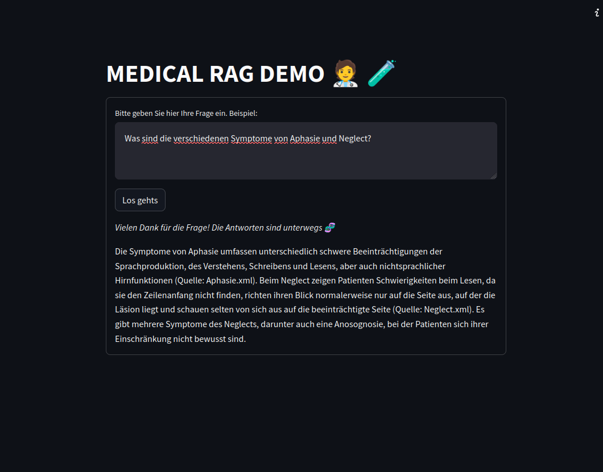
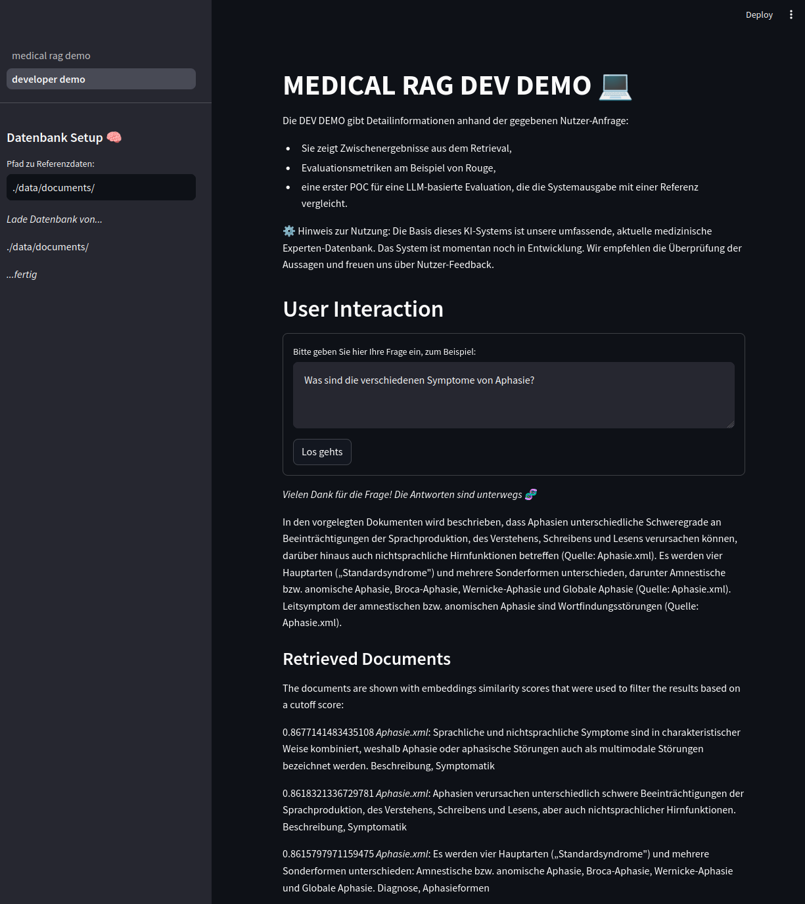

# rag-case-study

## What is this
* this is a basic POC for a rag systemdemo_2

## How...to set up the python environment
* create virtualenv ```virtualenv -p python3.12 venv_name ```
* activate virtualenv ```source venv_name/bin/activate```
* install requirements ```pip install -r requirements.txt```
## How...to set up API Keys
* This project uses the mistral api. You need to set up an account with [mistral.ai](https://mistral.ai) and create an API Key
  * add the API key to the environment variables 
    * for instance by writing ```MISTRAL_API_KEY=<your-mistral-api-key>``` to a `.env` file
    * and running ```export $(cat .env | xargs)``` in your working directory
* Optional: When using langchain libraries, I got warnings about a missing HF_TOKEN that is needed to access some tokenizers. 
* You need to set up an account with [huggingface.co](https://huggingface.co) and create an API Key
  * you also need to accept the terms for using mistral at huggingface [link](https://huggingface.co/mistralai/Mixtral-8x7B-v0.1)
  * add the API key to the environment variables
    * for instance by adding ```HF_TOKEN=<your-api-key>```to your `.env` file
    * and running ```export $(cat .env | xargs)``` in your working directorydemo
## How...to run the interactive demo ui
* set up API keys and environment as described above
* put the .xml documents from documents.zip into a folder and copy the absolute `path_to_data` 
* start the interactive demo with: ```streamlit run medical_rag_demo.py```
* go to your browser and enter the `path_to_data` to the sidebar in order to create the retrieval index
* query the demo (and be aware of rate limits)
* Note that the demo contains two apps 
  * the startup screen is the user demo aka _medical rag demo_. 
  * the second tab on the sidebar is the _developer demo_ that shows intermediate results and validation scores
  

## How...to query the rag system without the demo
* See tests in test_create_rag_pipeline.py
